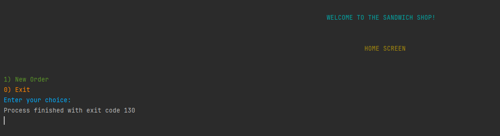
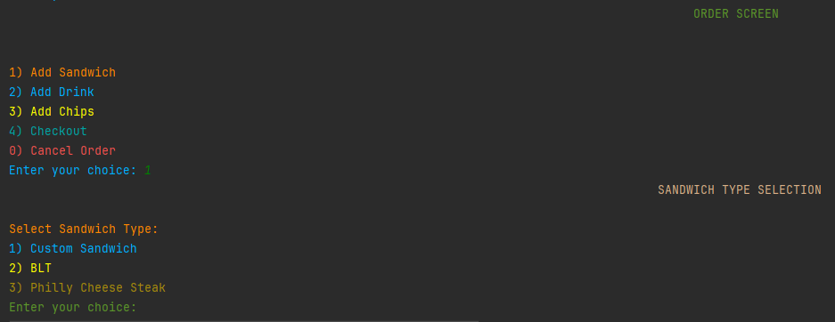
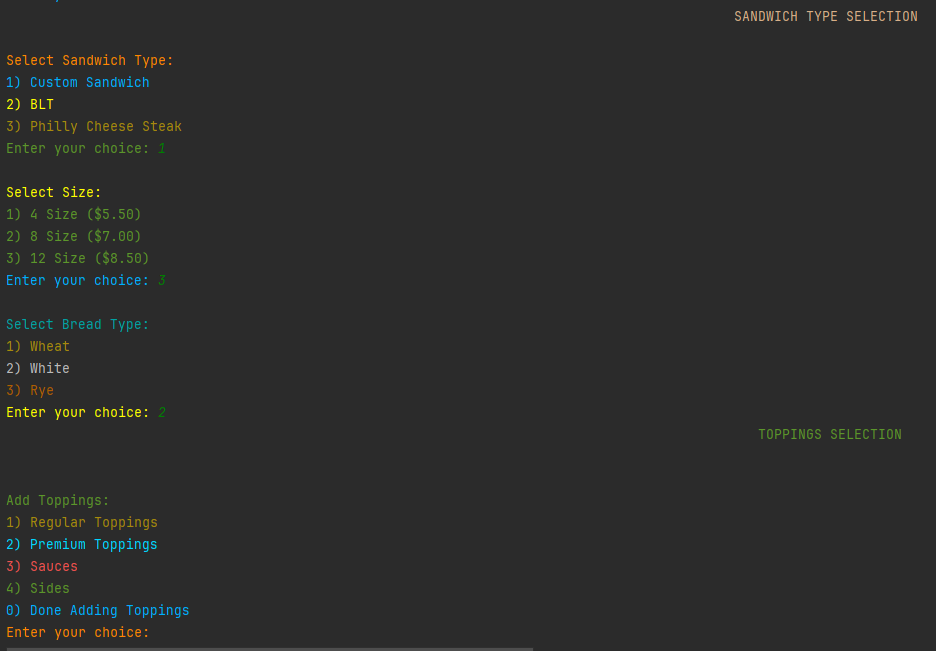
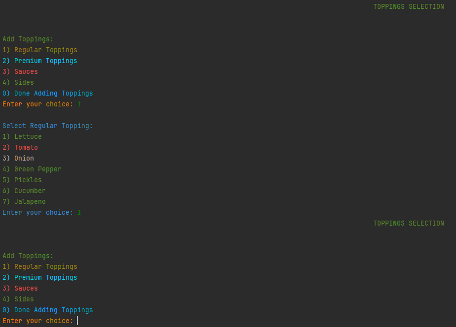
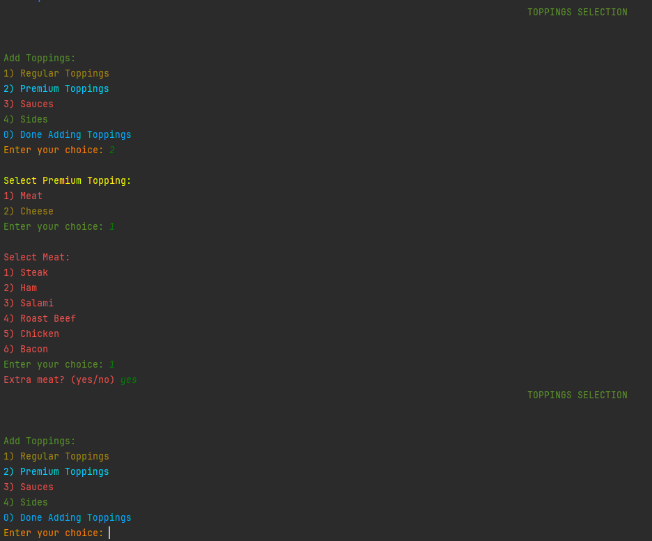

# DeliciousSandwichShop

### Main class is the entry point of your application. It simulates a sandwich ordering system in a console-based user interface. Here's a brief overview of its main functionalities:

🌶️ Main Loop: The main method starts an infinite loop that displays the home screen of the sandwich shop. The user can choose to create a new order or exit the application.

🥪

🌶️ Create Sandwich: If the user chooses to add a sandwich, the createSandwich method is called.

🥪

🌶️ This method allows the user to customize their sandwich by choosing the sandwich type, size, bread type, and whether it's toasted. It also calls the addToppings method to add toppings to the sandwich.

🥪

🌶️ Add Toppings: The addToppings method allows the user to add regular toppings, premium toppings, sauces, and sides to their sandwich.

🥪

🥪

🥪
