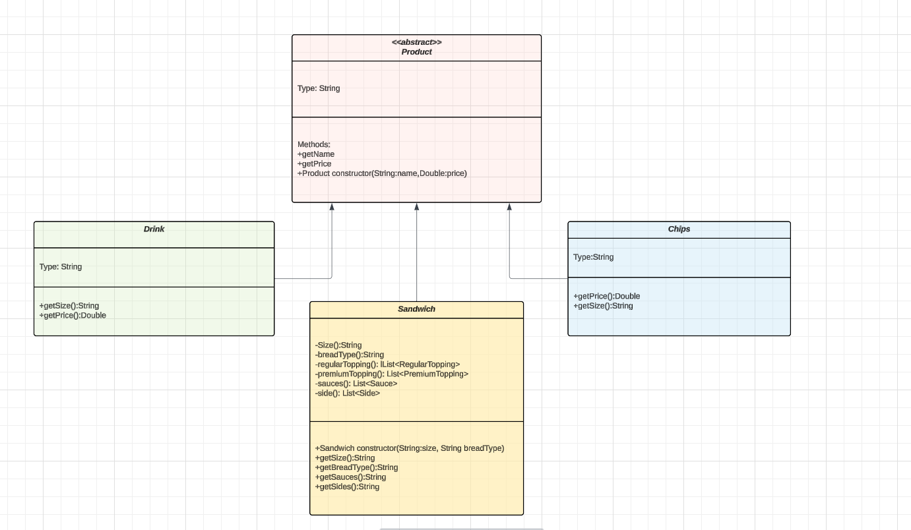

# DeliciousSandwichShop

## Diagram

#### ⚡ The classes Drink, Chips, and Sandwich are subclasses of the Product class.The Product class is an abstract class that represents a general product that can be ordered in the sandwich shop. It has two attributes: name and price.The subclasses Drink, Chips, and Sandwich inherit these attributes from the Product class. This means that each of these subclasses also has a name and a price attribute, and they can use these attributes as if they were defined in the subclasses themselves.⚡

⚡

## Main class is the entry point of application. It simulates a sandwich ordering system in a console-based user interface. Here's a brief overview of its main functionalities:

🌶️ Main Loop: The main method starts an infinite loop that displays the home screen of the sandwich shop. The user can choose to create a new order or exit the application.

🥪

🌶️ Create Sandwich: If the user chooses to add a sandwich, the createSandwich method is called.

🥪

🌶️ This method allows the user to customize their sandwich by choosing the sandwich type, size, bread type, and whether it's toasted. It also calls the addToppings method to add toppings to the sandwich.

🥪

🌶️ Add Toppings: The addToppings method allows the user to add regular toppings, premium toppings, sauces, and sides to their sandwich.

🥩 The addMeat method allows the user to add a type of meat to their sandwich.

🧀 The addCheese method allows the user to add a type of cheese to their sandwich.

🌶️ Add Sides: The addSides method allows the user to add sides to their order.

🥪

🌶️ Add Sauce: The addSauce method allows the user to add a sauce to their sandwich.

🥪

🍺 Create Drink: If the user chooses to add a drink, the createDrink method is called. This method allows the user to choose the size of the drink.

🥪

🌶️ Create Chips: If the user chooses to add a chips, the createChips method is called. Since SandwichShop has just only one type and size of chips, it is automatically adding chips without asking about size and type.

🥪

🌶️ Checkout: If the user chooses to checkout, the checkout method is called. This method displays the order summary and attempts to save the order to a file.

🥪

## ⚡ In summary, the Delicious Sandwich Shop point of sales application represents a crucial advancement in the operational efficiency and customer experience at DELI-cious. Through the use of Object-Oriented Programming, we have developed a versatile and user-friendly system that streamlines the order process from start to finish. This application not only addresses the current demands of our growing business but also lays a strong foundation for future enhancements such as online ordering and customer loyalty programs. Thank you for your time and attention. ⚡
