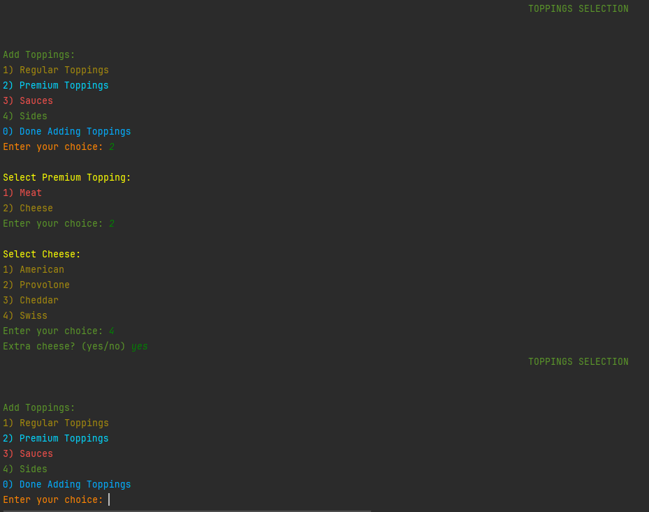

# DeliciousSandwichShop

### Main class is the entry point of your application. It simulates a sandwich ordering system in a console-based user interface. Here's a brief overview of its main functionalities:

🌶️ Main Loop: The main method starts an infinite loop that displays the home screen of the sandwich shop. The user can choose to create a new order or exit the application.

🥪

🌶️ Create Sandwich: If the user chooses to add a sandwich, the createSandwich method is called.

🥪

🌶️ This method allows the user to customize their sandwich by choosing the sandwich type, size, bread type, and whether it's toasted. It also calls the addToppings method to add toppings to the sandwich.

🥪

🌶️ Add Toppings: The addToppings method allows the user to add regular toppings, premium toppings, sauces, and sides to their sandwich.

🥩 The addMeat method allows the user to add a type of meat to their sandwich.

🧀 The addCheese method allows the user to add a type of cheese to their sandwich.

🌶️ Add Sides: The addSides method allows the user to add sides to their order.

🥪

🌶️ Add Sauce: The addSauce method allows the user to add a sauce to their sandwich.

🥪

🍺 Create Drink: If the user chooses to add a drink, the createDrink method is called. This method allows the user to choose the size of the drink.

🥪

🌶️ Create Chips: If the user chooses to add a chips, the createChips method is called. Since SandwichShop has just only one type and size of chips, it is automatically adding chips without asking about size and type.

🥪
